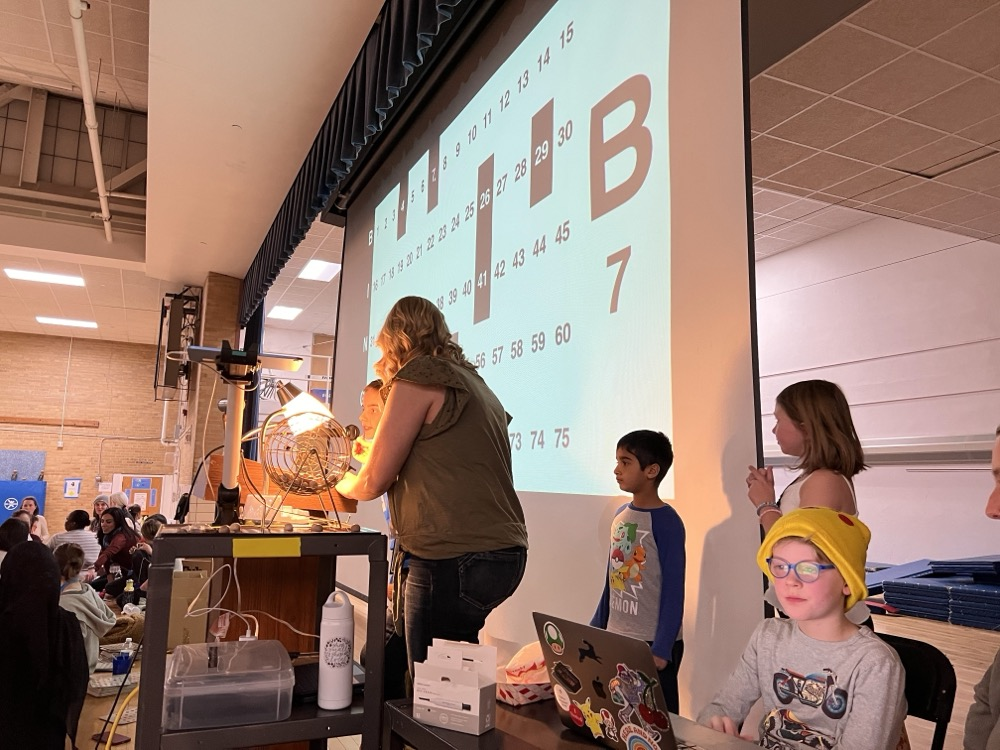

# Bingo board

This is a web application for tracking the state of a bingo game.

We've used it to run [Eisenhower Elementary](https://eisenhower.hopkinsschools.org/)'s Trilingual Bingo Night since 2023.

Game administrators pull numbered balls from a bin & this screen represents the state of the game & is operated by my son during the game.

I try to incrementally improve the code / UI each year.

## Usage

### Start

* Browse to https://bingo.meandmybadself.com
* Click / tap somewhere on the screen to go into fullscreen mode.
* Begin playing

### Gameplay

* Click / tap a number to toggle its state on the screen.
* Click / tap any of the letters to reset the state of the game.
* `Esc` key to leave fullscreen mode

## Technical Details

Bingo Board is a single–page Lit element that draws random bingo numbers, tracks state in `localStorage`, and is now built with a no-bundler TypeScript pipeline so GitHub Pages can serve the compiled output directly from the repo root.

## Development

### Prerequisites
- Node.js 18+
- npm 9+ (used for scripts below)

### Scripts
- `npm install` — install dependencies locally.
- `npm run dev` — run `tsc --watch` to continuously emit `dist/*.js` and `types/*.d.ts`.
- `npm run serve` — launch a static server via `python3 -m http.server 4173` so you can preview `index.html` at `http://localhost:4173`.
- `npm run build` — clean `dist`/`types` and produce a fresh one-off build.
- `npm run clean` — remove generated artifacts if you want to force a cold build.

### Local Development Flow
1. Install dependencies with `npm install`.
2. Start the compiler watcher: `npm run dev`.
3. In a second terminal, start the static server: `npm run serve`.
4. Visit `http://localhost:4173` and develop against the compiled files in `dist/`.

### Deployment on GitHub Pages
- GitHub Pages is configured to serve from the repository root, so the committed `index.html`, `dist/`, and `CNAME` files are the live site.
- After making changes, run `npm run build` and include the resulting `dist/` (and `types/` if package consumers need updated declarations) in your commit before pushing to `main`.
- The existing CI workflow runs `npm ci && npm run build` to ensure the build stays eproducible.